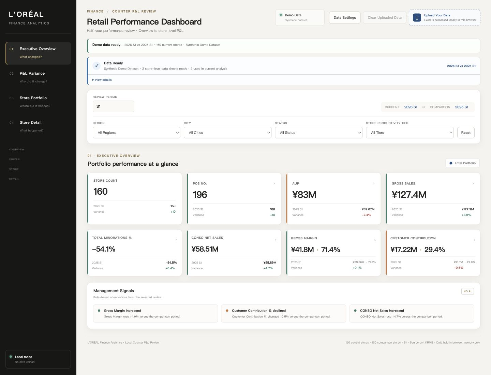
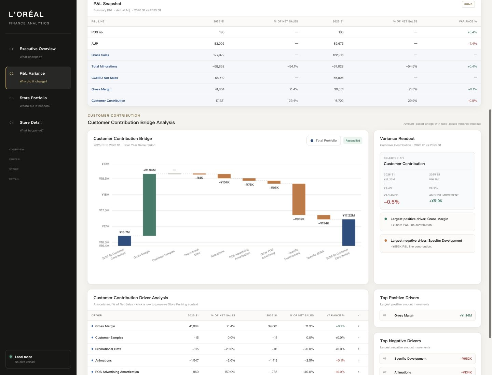
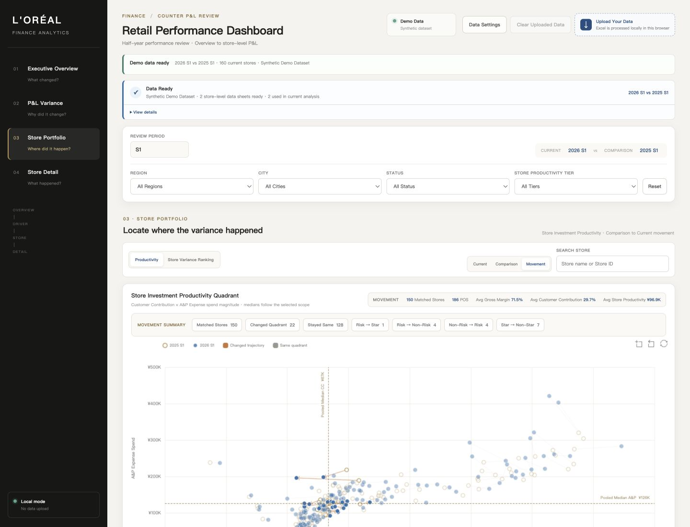
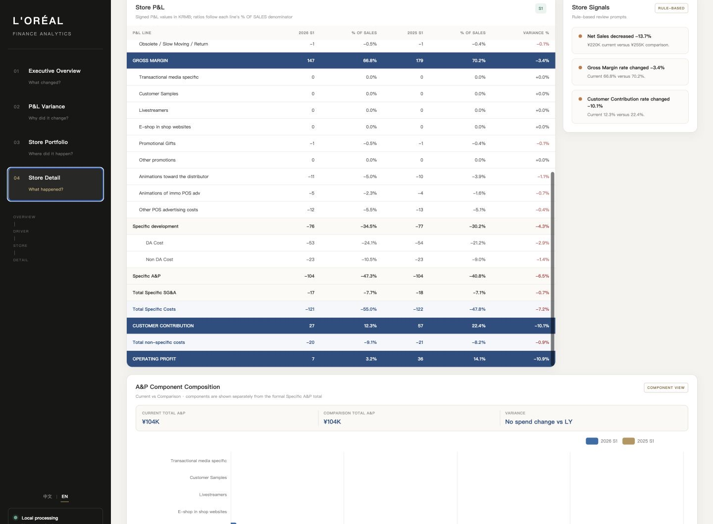

# 零售经营分析看板

[简体中文](README.zh-CN.md) | [English](README.md)

一个可交互的零售财务分析作品：从整体损益表变化下钻到具体门店和可采取的管理动作。

[**打开在线演示 →**](https://counter-performance-dashboard.vercel.app/)

> 在线演示使用模拟数据，仅用于产品功能展示。页面打开即可使用，无需上传或配置。

## 产品预览

### 经营概览

在同一个复盘界面查看经营 KPI、期间对比、筛选条件和管理提示。



### 差异分析

从损益表快照追踪客户贡献变动，并通过可勾稽的桥接和驱动因素解释原因。



### 门店组合分析

通过经营表现、人员效率和差异贡献三个视角筛查门店组合。



> 截图待更新：当前产品已使用新的三视角门店组合界面。

### 单店分析

下钻到单家门店，查看核心指标、经营提示、明细损益表与广告及促销投入构成。



## 分析路径

```text
经营概览 → 差异分析 → 门店组合分析 → 单店分析
```

演示数据展示 `2026 S1 vs 2025 S1`，包含 160 家当前期门店和 150 家对比期门店。四个页面、筛选、计算、图表和下钻共用同一套标准化模型和看板引擎。

## 核心功能

- **经营概览**：经营 KPI、期间变动与规则化管理提示。
- **差异分析**：损益表快照、客户贡献桥接、正负向驱动排名。
- **门店组合分析**：以 0 为双轴分界的客户贡献率 × 门店单产变化率经营表现图、门店总单产 × 销售人员人数横向筛查图，以及门店差异排名。
- **单店分析**：既有门店和新店画像、核心指标、包含本期/上年同期销售人员人数的明细损益表，以及广告及促销构成。
- **交互筛选**：区域、城市、状态和门店单产等级。
- **数据源切换**：可用本地工作簿替换演示数据；重置筛选不改变数据源；清除上传数据后返回演示模式。
- **中英文界面**：切换语言时保留当前页面、筛选、数据源、组合视图和已选门店。

## 数据准备

```text
Excel 上传
  → 工作表识别
  → 数据清洗
  → 校验
  → 当前期 / 对比期
  → 看板
```

演示模式仅展示标准化数据源的就绪状态，不会伪装成页面打开时扫描或清洗了 Excel。只有用户选择工作簿后，浏览器才会执行工作表识别、清洗和标准化。

## 架构与技术实现

```text
演示数据 / 已上传工作簿
  └─ 标准化模型
      └─ createDataService()
          └─ 共用 state、筛选、计算、图表、下钻与渲染
```

中英文界面也共用同一套 Core：翻译层只在渲染边界替换文案，不修改数据 schema、计算 key 或门店组合 canonical value。

- Vanilla JavaScript + 本地 classic scripts
- ECharts + SheetJS
- 纯浏览器运行，无后端依赖
- 支持 `file://` 离线打开

## 数据与隐私

- 在线演示使用模拟数据，仅用于产品功能展示。
- 用户选择的工作簿仅在本地浏览器中处理。
- 工作簿数据不会写入 `localStorage`；`localStorage` 仅用于可选的语言偏好和字段映射设置。
